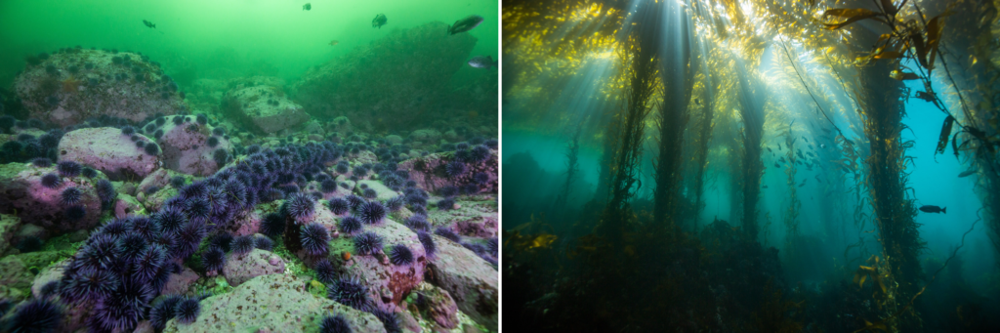

# BIOE 276 Final Project

## Environmental Drivers of Purple Urchin Gonad Index in Central California

Photo by Michael Langhans

### Project Overview

This project explores habitat variables in kelp forest and urchin barren systems in central California and their influence on the condition of purple sea urchins (*Strongylocentrotus purpuratus*). By calculating the mean gonadosomatic index of urchins within each surveyed site and surveying habitat variables, we can investigate which habitat variables have the most effect on urchin condition.

#### Research Question

To what extent do biological and environmental variables predict **sea urchin gonad index** across kelp forests and urchin barrens, and which variables are the strongest predictors of gonad index?

#### Target Audience:

Kelp forest recovery researchers and restoration practitioners

##### *Please refer to the "Explanatory Data Analysis" file for an in-depth summary of this project (in its final form), including background information, methods, analyses, and conclusions.* To learn more about our exploration of the data, specifically methods we tried out and did not include in our final analyses, refer to the "Exploratory Data Analysis" file. 
